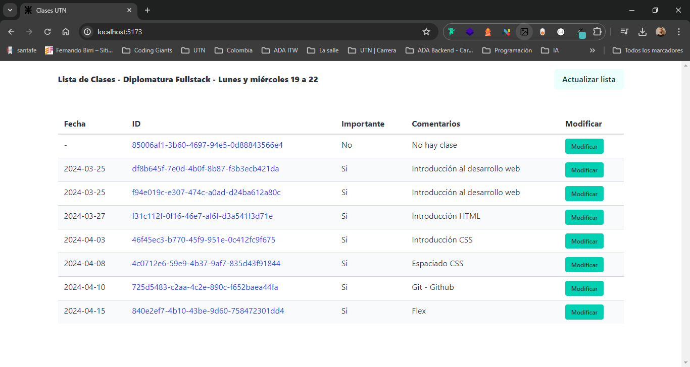

# Aplicación de Gestión de Clases

Esta aplicación consta de un servidor Express en el lado del backend y una interfaz de usuario desarrollada con React en el frontend. Permite la gestión de una lista de clases, con funcionalidades para actualizar la información de cada clase, marcarlas como importantes y agregar comentarios.

## Captura de pantalla UI



## Instalación

1. Clona este repositorio en tu máquina local.
2. Instala las dependencias del servidor y del cliente ejecutando:

```bash
npm run install-services
```

3. Crea un archivo .env en el directorio del backend y define la variable de entorno **URL** con el enlace facilitado por la UTN para acceder a la base de datos de las clases.

## Configuración del Servidor

- Crea una carpeta **data** en el directorio `/backend`, dentro un archivo llamado mappedClass.json. Este archivo debe contener un array vacío que será utilizado por el servidor para pushear la información de las clases.

## Ejecución

- En la raíz del proyecto, ejecuta npm start para iniciar tanto el servidor como el cliente.

## Uso

### Interfaz de Usuario

- La interfaz muestra una lista de clases con su fecha, ID, estado de importancia y comentarios.
- Puedes hacer clic en el botón "Modificar" para editar la información de una clase.
- Se abrirá un modal donde podrás actualizar la fecha, marcar la clase como importante y agregar comentarios.
- Una vez completada la modificación, haz clic en "Enviar" para guardar los cambios.

### Servidor

El servidor expone dos endpoints:

- PATCH /api/update: Actualiza la lista de clases basada en la base de datos original. Elimina las clases que ya no existen y agrega las nuevas.
- GET /api: Devuelve la lista de clases en su estado actual.
- PATCH /api: Permite la modificación de una clase específica mediante su ID.

## Observaciones

- Asegúrate de tener correctamente configuradas las variables de entorno en el archivo .env.
- El archivo mappedClass.json debe estar presente en la carpeta data del servidor con un array vacío inicial.
- Este archivo será leído y modificado por el servidor según las acciones realizadas en la interfaz de usuario.

## Tecnologías Utilizadas

- **Express:** Para el desarrollo del servidor backend.
- **React:** Para la creación de la interfaz de usuario dinámica.
- **axios:** Para realizar solicitudes HTTP tanto en el servidor como en el cliente.
- **dotenv:** Para la gestión de variables de entorno.
